  <h2> Всем привет! Меня зовут Иван! </h2>

<em>Я начинающий (и много раз продолжающий) разработчик из России, увлекающийся программированием </em>

<!-- Контактные бейджи -->

  
  

---

<!-- Двухколоночный макет: Обо мне (слева) и Статистика GitHub (справа) -->
<table>
  <tr>
    <td valign="top" width="45%"> <!-- Ширина левой колонки -->
      <h3> Немного обо мне...</h3>
      

          
<b>Стек технологий:</b> C#

          
<b>Текущий проект:</b> <a href="https://github.com/mesheni/VidDownload" target="_blank" rel="noopener noreferrer">VidDownload</a>

          
<b>Telegram-бот:</b> <a href="https://t.me/mesh_weather_ai_bot" target="_blank" rel="noopener noreferrer">mesh_weather_ai_bot</a>

          
<b>Учусь:</b> разработке на C#

          
<b>Контакты:</b>

          <ul style="margin-top: 0; margin-bottom: 0.8em; padding-left: 25px; list-style-type: '📫 '; ">
              <li><b>Email:</b> <a href="mailto:mesheni@proton.me">mesheni@proton.me</a></li>
              <li><b>Telegram:</b> <a href="https://t.me/meshenii" target="_blank" rel="noopener noreferrer">t.me/meshenii</a></li>
          </ul>
      

    </td>
    <td valign="top" width="55%" align="center"> <!-- Ширина правой колонки -->
      <!-- Основная статистика GitHub Metrics -->
      <a href="https://github.com/lowlighter/metrics"> <!-- Опционально: ссылка на репозиторий lowlighter/metrics -->
          <!-- Изображение займет всю ширину ячейки -->
      </a>
    </td>
  </tr>
</table>

---

### 🛠️ Языки и Инструменты:

  
  
  <!-- Добавьте другие технологии, если используете, например: -->
  
  

---

### 🚀 Мои проекты

Здесь вы найдете несколько проектов, которые могут вас заинтересовать:

*   **VidDownload**: [Приложение для загрузки видео](https://github.com/mesheni/VidDownload) с различных платформ на основе `yt-dlp`.
*   **Телеграм-бот погоды и AI**: Мой персональный [бот для Telegram](https://t.me/mesh_weather_ai_bot).

---

### 📊 Другая статистика на GitHub

  <!-- График активности GitHub -->
  
    

---

  
   
  <em><b>Рад новым знакомствам и общению!</b> Если хочешь поздороваться или обсудить что-то, <b>буду рад пообщаться!</b> 😊</em>
    
  Спасибо за посещение моего профиля! Надеюсь, вы найдете здесь что-то интересное и полезное.

